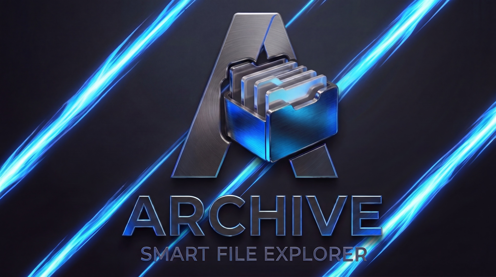
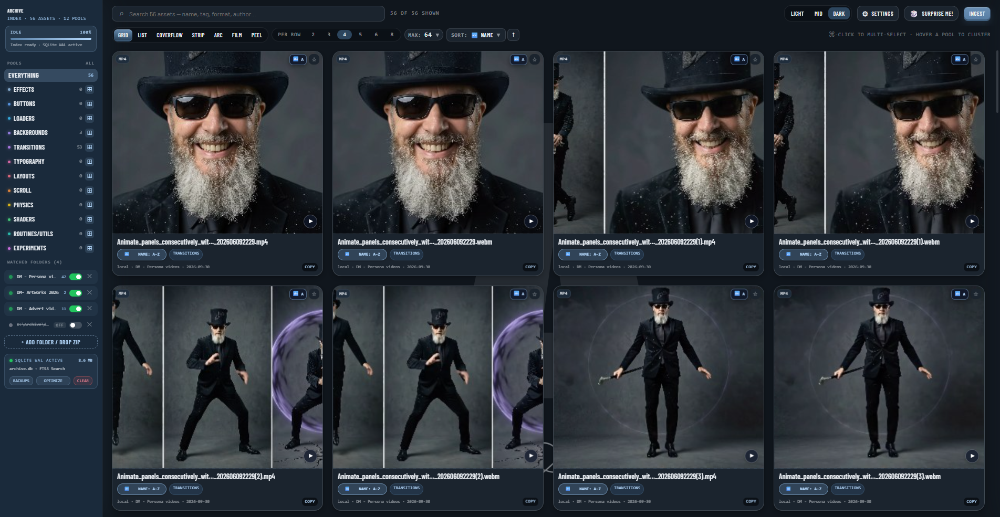
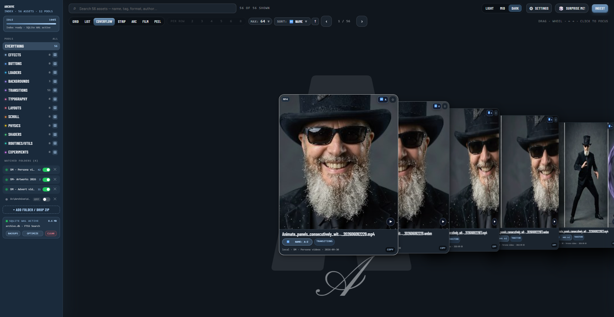
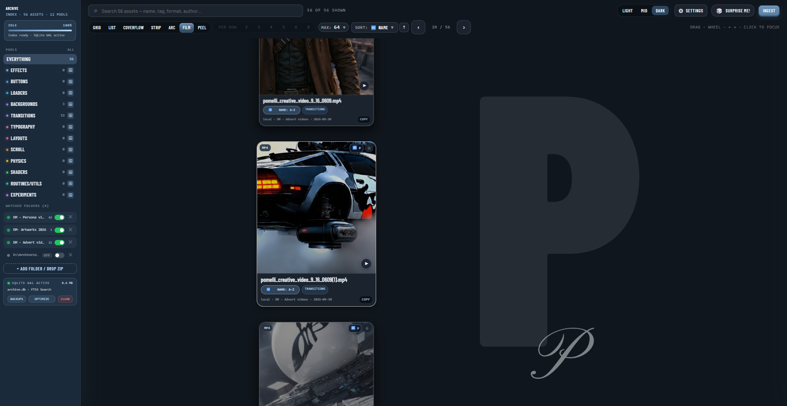
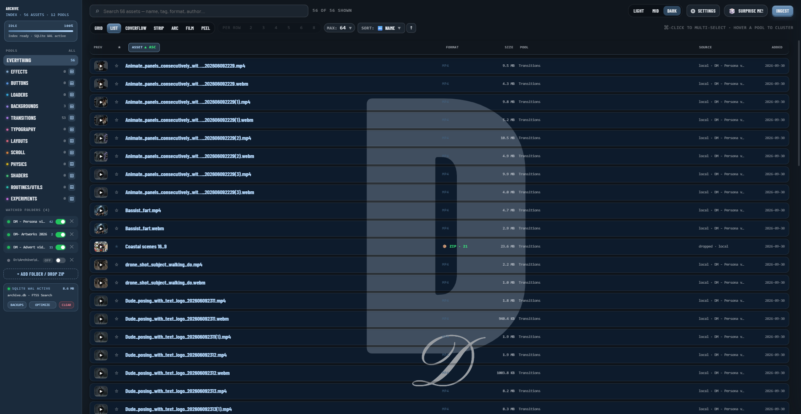
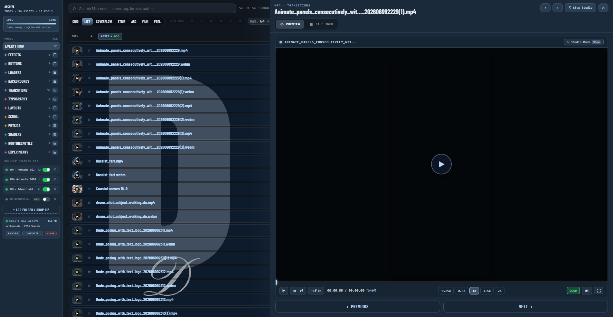
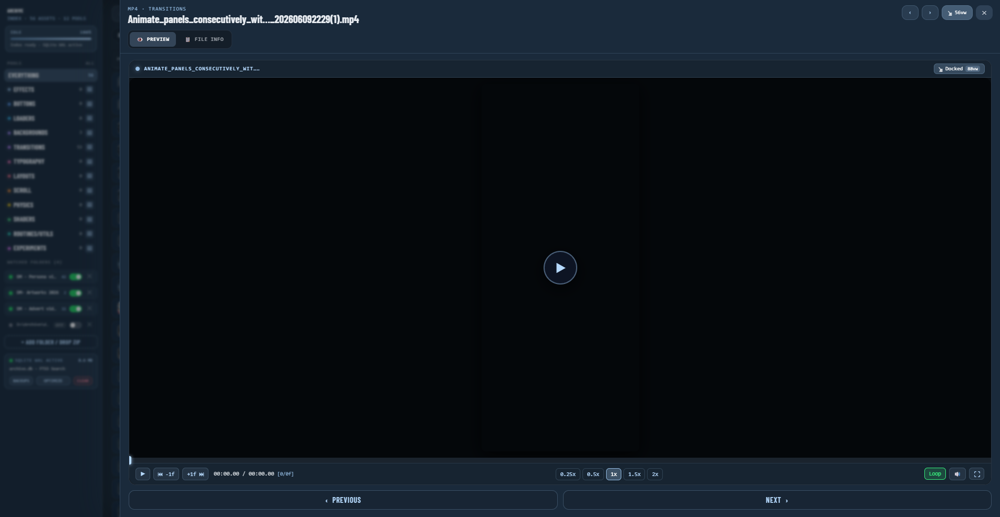
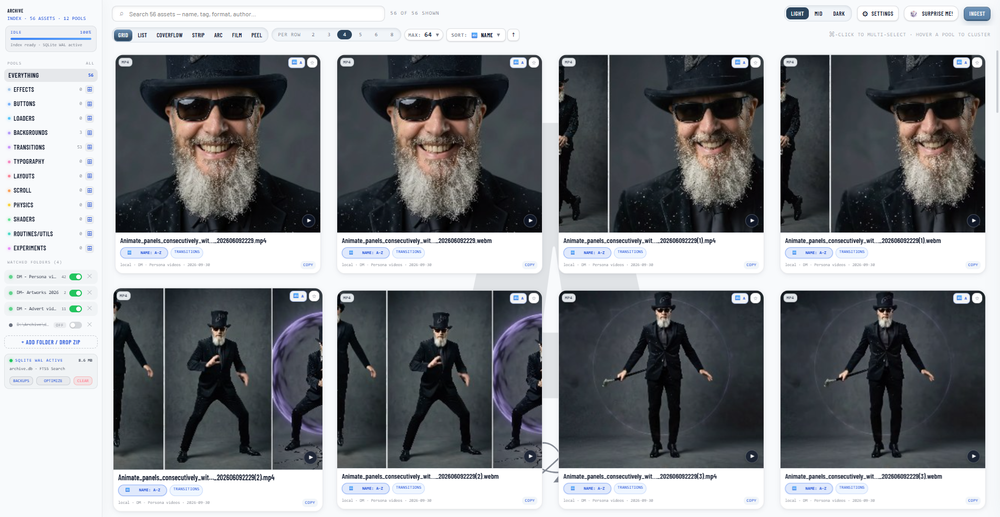
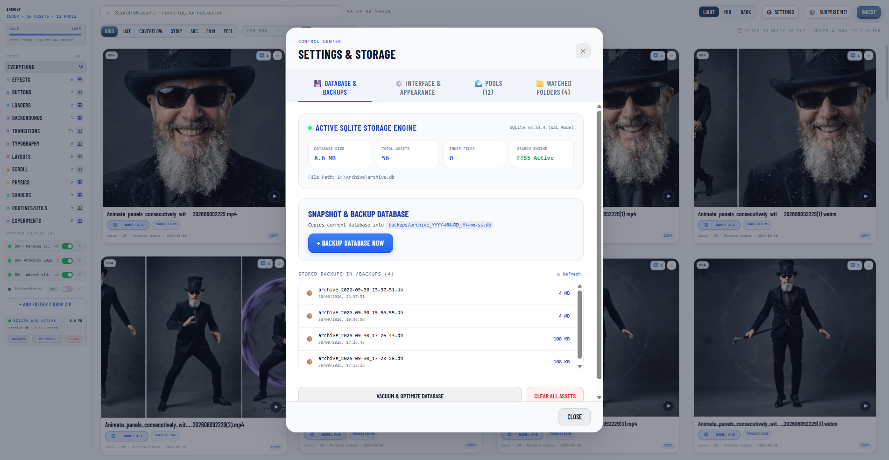
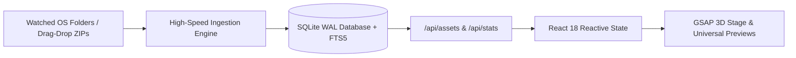

<div align="center">



<br/>

# ARCHIVE
### All of your media, all in one place.

[](https://vitejs.dev/)
[](https://react.dev/)
[](https://www.typescriptlang.org/)
[](https://www.sqlite.org/)
[](https://greensock.com/)
[](https://threejs.org/)
[](https://opensource.org/licenses/MIT)
[](https://www.designmechanic.co.uk/)

```text
┌────────────────────────────────────────────────────────────────────────────────────────────────────────┐
│ ARCHIVE v1.0.12 │  🔍 Search assets, tags, code, pools... (Cmd+K)  │  56 ASSETS  │  [ LIGHT | MID | ◉ DARK ] │
├─────────────────┴──────────────────────────────────────────────────────────────────────────────────────┤
│ VIEWS: [ ◉ GRID (2-8) | COVERFLOW 3D | STRIP | ARC/RADIAL | FILMSTRIP | PEEL | LIST TABLE ]  │  SORT: [ NAME ▲ ]│
└────────────────────────────────────────────────────────────────────────────────────────────────────────┘
```

</div>

---

## ⚡ Overview

**Archive** brings all of your media together into one fast, beautiful, and interactive space. Whether you have thousands of photos, videos, vector logos, font packages, 3D models, audio tracks, or documents scattered across different folders and drives, Archive lets you organize, search, and preview everything without slowing down.

### Why You'll Love It:
* 🔒 **100% Private & Local-First**: Runs directly on your computer. Zero subscriptions, zero cloud fees, and your files never leave your machine.
* ⚡ **Instant Search**: Find any asset in milliseconds by name, file extension, tag, or collection.
* 🎭 **7 Dynamic Visual Views**: Switch between responsive grids, 3D Coverflow, filmstrips, radial wheels, card peels, and structured data tables with a single click.
* 👁️ **Universal In-App Previews**: Inspect videos with frame-by-frame scrubbing, rotate 3D models in 360°, test fonts with live typing specimens, read PDFs, and extract color palettes without opening heavy external apps.
* 📦 **Inspect ZIPs Without Extracting**: Peek inside ZIP packages and preview inner assets directly without unzipping them to disk.
* 🎨 **Organize Your Way**: Group assets into custom colored pools and collections that match your unique workflow.

<details>
<summary><b>🔧 Bypass the boring bits: Technical Architecture & Under the Hood</b></summary>

<br/>

**For developers, creative technologists, and system builders:**

Archive is an industrial-grade, local-first visual asset operating system engineered for high throughput, sub-millisecond search, and hardware-accelerated spatial presentation:

* **SQLite WAL & FTS5 Full-Text Engine**: Powered by a high-throughput **SQLite WAL (Write-Ahead Logging)** backend with memory-mapped I/O (`mmap_size = 30GB`), PRAGMA cache optimizations, and an **FTS5 full-text search index** capable of indexing multi-gigabyte asset folders with sub-millisecond query execution.
* **Reactive Frontend**: Built on a modern **React 18 + TypeScript + Vite** architecture with instant hot-module replacement and zero runtime overhead.
* **GSAP 3D Spatial Choreography**: Custom **GSAP** hardware-accelerated matrix transforms (`rotateY = ±46°`, `rotateX = ±40°`, dynamic z-depth layer translation, and spring physics) running at a locked 60fps.
* **Universal Rendering Pipeline**: Integrated **Three.js** WebGL renderer for 3D glTF/OBJ models, **PDF.js** web-worker canvas renderer, client-side color quantization palette extractors, and sandboxed iframe runners for interactive HTML/CSS/WebGL code experiments.
* **Streaming Disk Ingestion**: Dual-engine ingestion using the HTML5 File System Access API and an asynchronous Node.js crawler with chunked streaming and background thumbnail generation.
* **Automated Point-in-Time Backups**: One-click database snapshots saved to `/backups/archive_YYYY-MM-DD_HH-mm-ss.db` with database `VACUUM` and `PRAGMA optimize` built in.

</details>

---

## 📸 Snapshots & Interface Tour

### 1. Fluid Responsive Grid & Left Rail Navigation
> *Adaptive 2 to 8-column layout with 3D tilt hover physics, live indexer progress, watched disk folders, and real-time category pools.*



<br/>

### 2. Apple-Style 3D Coverflow & Vertical Filmstrip
> *Kinetic spatial presentation modes engineered for serendipitous visual exploration and rapid storyboarding.*

| 3D Coverflow Perspective (`rotateY = ±46°`) | 3D Vertical Filmstrip Scrub (`rotateX = ±40°`) |
| :---: | :---: |
|  |  |

<br/>

### 3. Dense Structured List Table (Sticky Headers & Sort Highlighting)
> *High-density data management with interactive sort column indicators, live format badges, file size calculations, and background watermark branding.*



<br/>

### 4. Dual-Width Universal Preview Suite
> *Dedicated media viewports with custom video speed pills, frame-stepping (`-1f`, `+1f`), audio scrubbers, and instantaneous expansion between standard dock (`56vw`) and cinema studio mode (`88vw`).*

| Docked Preview Mode (`56vw`) | Expanded Studio Mode (`88vw`) |
| :---: | :---: |
|  |  |

<br/>

### 5. High-Contrast Swiss Light Theme & SQLite Control Center
> *Complete token-driven design system supporting Dark (`#10161d`), Mid Slate (`#182636`), and Pure Light (`#f8fafc`), backed by a dedicated SQLite WAL maintenance and backup suite.*

| Swiss Clean Light Mode | SQLite Control Center & Automated Backups |
| :---: | :---: |
|  |  |

---

## 🚀 Key Architecture & Features

### 🗄️ 1. Dual-Tier Local Storage Engine (SQLite WAL + IndexedDB)
* **SQLite Backend (`better-sqlite3`)**: Runs in **WAL (Write-Ahead Logging)** mode with an integrated **FTS5 (Full-Text Search)** virtual table. Queries over 50,000+ asset titles, tags, and authors execute in under 4ms.
* **IndexedDB Fallback (`idb`)**: Zero-install standalone browser operation when running without a Node.js daemon.
* **Automated Point-in-Time Backups**: One-click database snapshots saved to `/backups/archive_YYYY-MM-DD_HH-mm-ss.db` with database VACUUM and PRAGMA optimization built in.



---

### 🎭 2. Seven Hardware-Accelerated Presentation Modes

<details>
<summary><b>Click to expand the 7 View Modes</b></summary>

<br/>

1. **Grid View**: Fluid density scaling (2, 3, 4, 5, 6, 8 cards per row). Card dimensions scale fluidly (`height = width * 0.74 + 132`) with mouse-tracking 3D card tilt and hover lift.
2. **List View**: Dense structured table with sticky headers, column sorting indicators, star toggles, format badges, and letterform background watermarks.
3. **Coverflow View**: Apple-style 3D perspective stack with dynamic Y-axis tilt (`rotateY = -clamp(d * 30, ±46)`), depth stacking (`z = -|d| * 190`), and vertical curvature.
4. **Strip View**: Snap-elastic horizontal carousel with fluid flick gestures and focal card scaling (`1.06×`).
5. **Arc / Radial View**: Circular wheel projection (`R = 1150px`, `angle = d * 0.115`, `rotateZ = d * 6.6°`) opening directly on the focal card.
6. **Filmstrip View**: Vertical 3D perspective scrub with tilt (`rotateX = -clamp(d * 13, ±40)`) and timeline wheel gestures.
7. **Peel View**: Physical stacked deck. Previous cards fly away rotated `-16° * k`, while upcoming cards remain neatly stacked.

</details>

---

### 👁️ 3. The 12 Universal Viewports

<details>
<summary><b>Click to expand the 12 Universal Viewports in SidePanel</b></summary>

<br/>

1. **Image Viewport (`ImageViewer`)**: Infinite pan & zoom ($25\%$ to $800\%$), pixel grid overlay at $\ge 400\%$, automatic dominant color palette extractor (one-click hex copy), and backdrop toggles (checkerboard, deep pitch black, stark white).
2. **Video Viewport (`VideoViewer`)**: Custom GSAP video controls, hover scrub bar with buffer gauge, speed selector pills (`0.25x`, `0.5x`, `1x`, `1.5x`, `2x`), frame stepping (`-1 Frame` / `+1 Frame`), volume slider, and fullscreen popout.
3. **Audio Viewport (`AudioViewer`)**: Real-time canvas waveform spectrum visualizer, frequency bars, loop toggle, and audio technical badges.
4. **3D Mesh Viewport (`ThreeViewer`)**: Native WebGL Three.js renderer for `.glb`, `.gltf`, and `.obj` models with OrbitControls, studio 3-point lighting, clay MatCap mode, polygon wireframe toggle, and floor coordinate grid.
5. **Vector Viewport (`VectorViewer`)**: Lossless vector zoom ($1000\%+$), outline/wireframe stroke mode for Bezier curve auditing, path count HUD, "Copy Clean SVG", and "Copy Data URI".
6. **PDF Viewport (`PdfViewer`)**: Interactive multi-page PDF viewer with rotation and zoom controls.
7. **Markdown Viewport (`MarkdownViewer`)**: GFM Markdown engine with auto-generated Table of Contents drawer, heading anchor jumps, font size stepper, line and word count HUD, and estimated reading time.
8. **Document Viewport (`DocViewer`)**: Formatted and raw text reader with copy actions.
9. **Code Viewport (`CodeViewer`)**: Monospace syntax-styled inspector with line number gutters, soft-wrap toggle, code search with match counters, and font size adjustment.
10. **JSON Viewport (`JsonViewer`)**: Hierarchical tree explorer with node expand/collapse, instant key/value search filter, type pill color-coding, and beautify/minify toggle.
11. **CSS Viewport (`CssViewer`)**: Style rule tokenizer and color extractor with clickable palette swatches.
12. **HTML Sandbox Viewport (`HtmlViewer`)**: Isolated sandbox runner for interactive HTML components with responsive viewport presets (Desktop, Laptop, Tablet, Mobile) and live animation replay.

</details>

---

### 🗂️ 4. Customizable Category Pools (Example Starter Template) & 3D "Throw" Curation

> [!NOTE]
> The **12 default pools** shown below represent an **example starter template** for UI & motion design workflows. You are encouraged to customize, rename, recolor, reorder, or delete them to fit your own creative discipline (e.g. Photography, 3D Art, Client Brands, AI Concept Seeds). Open **⚙️ Settings › Pools (12)** to manage your custom collection — any rename or deletion automatically cascades across your SQLite database.

<details>
<summary><b>Click to view the default starter pool collection</b></summary>

<br/>

* 🟣 **Effects**: Visual UI enhancements, glow shaders, and canvas particles.
* 🔵 **Buttons**: Interactive buttons, magnetic micro-interactions, and CTA components.
* 🟡 **Loaders**: Spinners, skeleton loaders, and progress gauges.
* 🟢 **Backgrounds**: Stock photography, generative textures, normal maps, and wallpapers.
* 🔴 **Transitions**: UI motion cuts, stock video clips, and video effects.
* 🟠 **Typography**: OTF/TTF/WOFF brand typefaces with interactive live typing specimens.
* 🟣 **Layouts**: Grid templates, wireframes, and responsive layout blueprints.
* 🔵 **Scroll**: Parallax handlers, smooth scroll routines, and sticky headers.
* 🟡 **Physics**: Matter.js simulations, bouncy springs, and collision demos.
* 🟢 **Shaders**: GLSL vertex/fragment shaders and WebGL noise canvases.
* 🔴 **Routines/utils**: Helper scripts, debounce utilities, and math algorithms.
* ⚪ **Experiments**: Unfinished concepts, generative art, and creative prototypes.

> **Tactile "Throw-Into" Interaction**: Multi-select cards using `Cmd/Ctrl/Shift + Click`. A floating glass action bar appears at the bottom; clicking any pool triggers a physical 3D trajectory animation (`scale: 0.1`, `rotateZ: -30°`) flying the cards directly into the Left Rail pool target.

</details>

---

## ⚡ Keyboard Shortcuts

| Shortcut | Scope | Action |
| :--- | :--- | :--- |
| <kbd>←</kbd> / <kbd>→</kbd> | Stage | Step carousel backward or forward |
| <kbd>Escape</kbd> | Global | Close open Side Panel, Ingest Modal, or Settings Modal |
| <kbd>⌘</kbd> / <kbd>Ctrl</kbd> + Click | Cards | Toggle individual card in multi-selection |
| <kbd>Shift</kbd> + Click | Cards | Select range of cards |
| <kbd>[</kbd> / <kbd>]</kbd> | Preview | Frame-step backward / forward (`0.04s`) or previous / next asset |
| <kbd>Space</kbd> | Video Viewport | Play / Pause media playback |
| <kbd>A-</kbd> / <kbd>A+</kbd> | Markdown / Code | Decrease or increase text font size |

---

## 🛠️ Quick Start

### Prerequisites
* **Node.js** `v18.0.0` or higher (`v20+` recommended)
* **npm** `v9.0.0` or higher

### Installation & Launch

```bash
# 1. Clone the repository
git clone https://github.com/designmechanics/Archive.git
cd Archive

# 2. Install dependencies
npm install

# 3. Start local development server (with SQLite WAL backend)
npm run dev

# 4. Open in your browser
# Server runs at http://127.0.0.1:6080
```

### Production Build

```bash
# Build optimized production bundle
npm run build

# Preview production build locally
npm run preview
```

### Automated UI Snapshot Generator

```bash
# Run headless Chrome automated capture to refresh docs/assets/
npm run snapshots
```

---

## 🎨 Creative Workflows Guide

For in-depth guides on using Archive as a creative instrument, explore **[CREATIVE_WORKFLOWS_GUIDE.md](CREATIVE_WORKFLOWS_GUIDE.md)**:
* **Ideation & Creative Direction**: Spatial moodboarding across Coverflow and Peel decks.
* **Picture Creation & Art Direction**: 800% zoom inspection, dominant color palette extraction for AI prompt seeds (`--sref`), and 3D lighting studies.
* **Logo Design & Brand Identity**: Infinite vector zoom, outline/wireframe stroke auditing, and live multi-scale font specimen typing.

---

## 📁 Repository Structure

```text
Archive/
├── docs/
│   └── assets/                     # High-resolution UI snapshots & showcase graphics
├── public/                         # Public assets & PDF.js Web Workers
├── scripts/
│   └── capture_all.js              # Automated Chrome CDP screenshot generator
├── server/
│   ├── api.js                      # Express/Connect REST API (/api/assets, /api/stats)
│   ├── db.js                       # SQLite WAL backend engine (better-sqlite3)
│   ├── scanner.js                  # Asynchronous high-speed disk directory crawler
│   └── vitePlugin.js               # Integrated Vite middleware bridge
├── src/
│   ├── components/
│   │   ├── preview/                # 12 Universal Preview viewports (3D, Video, Vector, etc.)
│   │   ├── Header.tsx              # Top search bar, theme toggles, and ingest trigger
│   │   ├── ListView.tsx            # High-density data table with sticky headers
│   │   ├── Rail.tsx                # Left rail navigation, pools, and watched folders
│   │   ├── SelectionBar.tsx        # Floating multi-select bar with 3D throw action
│   │   ├── SettingsModal.tsx       # SQLite WAL control center, backups, and pool editor
│   │   ├── SidePanel.tsx           # Dual-width preview drawer (56vw / 88vw)
│   │   ├── Stage.tsx               # 7 GSAP presentation views and gesture handler
│   │   └── Toolbar.tsx             # View switcher, density, and sort controls
│   ├── data/
│   │   └── seedData.ts             # 54 canonical creative assets & MIME classifications
│   ├── services/
│   │   ├── api.ts                  # Reactive frontend SQLite API client
│   │   ├── db.ts                   # Hybrid storage orchestrator (SQLite + IndexedDB)
│   │   ├── indexingEngine.ts       # Client-side streaming ingestion pipeline
│   │   └── zipService.ts           # Byte-range ZIP central directory streaming reader
│   ├── types/                      # Comprehensive TypeScript schemas
│   ├── App.tsx                     # Master layout grid & application controller
│   └── main.tsx                    # React DOM root entry
├── index.html                      # Root HTML template with design tokens & responsive CSS
├── package.json                    # Project configuration & npm scripts
├── tsconfig.json                   # TypeScript compiler configuration
└── vite.config.ts                  # Vite build & server configuration
```

---

## 📄 License

This project is licensed under the **MIT License** — see the [LICENSE](LICENSE) file for details.

---

<div align="center">
  <sub>Built with precision by <a href="https://www.designmechanic.co.uk/" target="_blank"><b>designmechanics</b></a> for creative technologists worldwide.</sub>
</div>
